## 1. Object State Modeling with State Transition Diagrams: 

Object 1: Expense Entry
This object tracks the lifecycle of a single transaction.

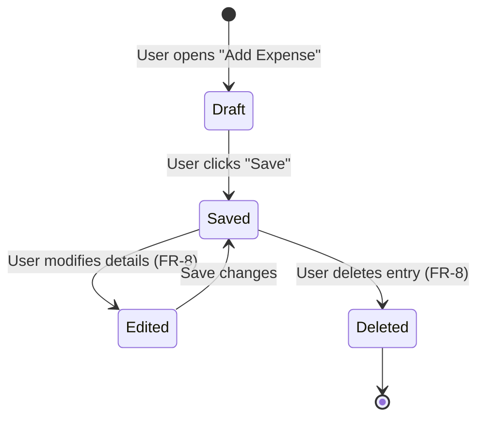

Key States: Draft (unsaved data), Saved (stored in DB), Deleted (removed from view).
Traceability: Maps to FR-2 (Log Expense) and FR-8 (Edit/Delete transactions).

Object 2: User Account
Focuses on security and session management.

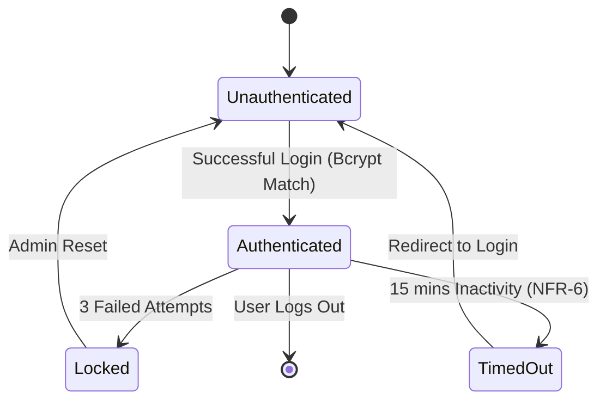
  
Key States: Authenticated, Locked (security measure), TimedOut.
Traceability: Maps to FR-1 (Create Account) and NFR-6 (15-minute auto-logout).

Object 3: Monthly Budget
Controls the status of category limits.

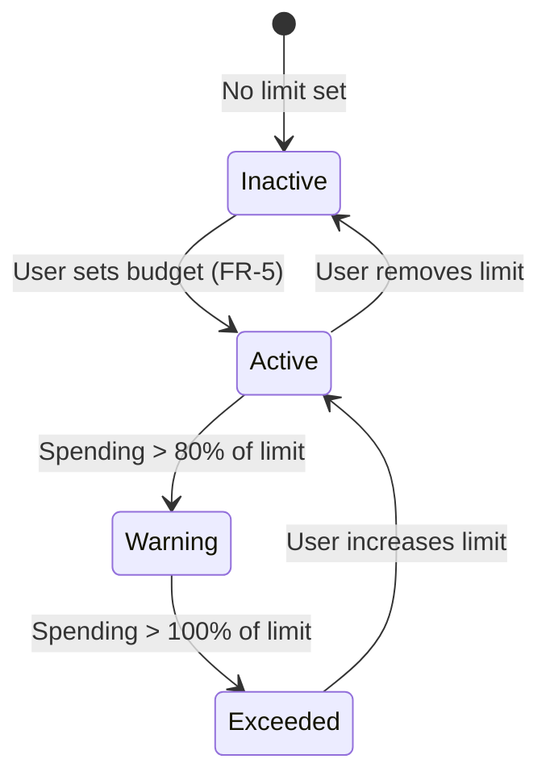

Key States: Active, Warning, Exceeded.
Traceability: Maps to FR-5 (Set monthly budget limit).

Object 4: Spending Chart
Ensures the UI stays synchronized with data.

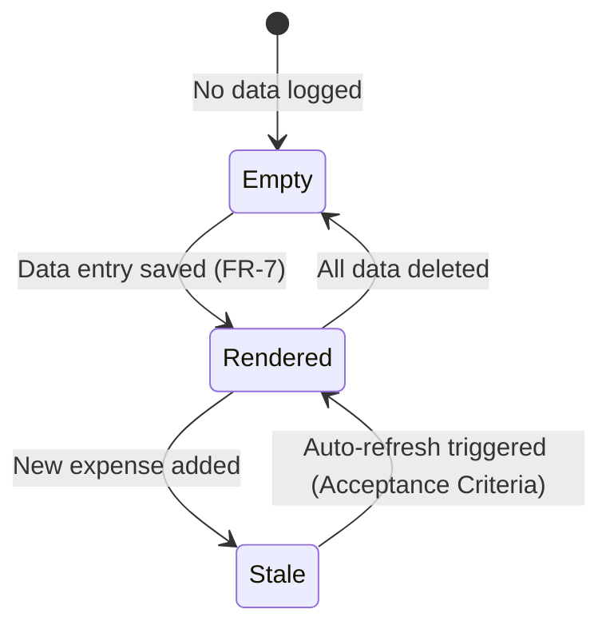

Key States: Stale (needs update), Rendered (current).
Traceability: Maps to FR-7 (Visual charts update immediately).

Object 5: Database Connection (Docker Environment)
Handles the technical availability of the system.

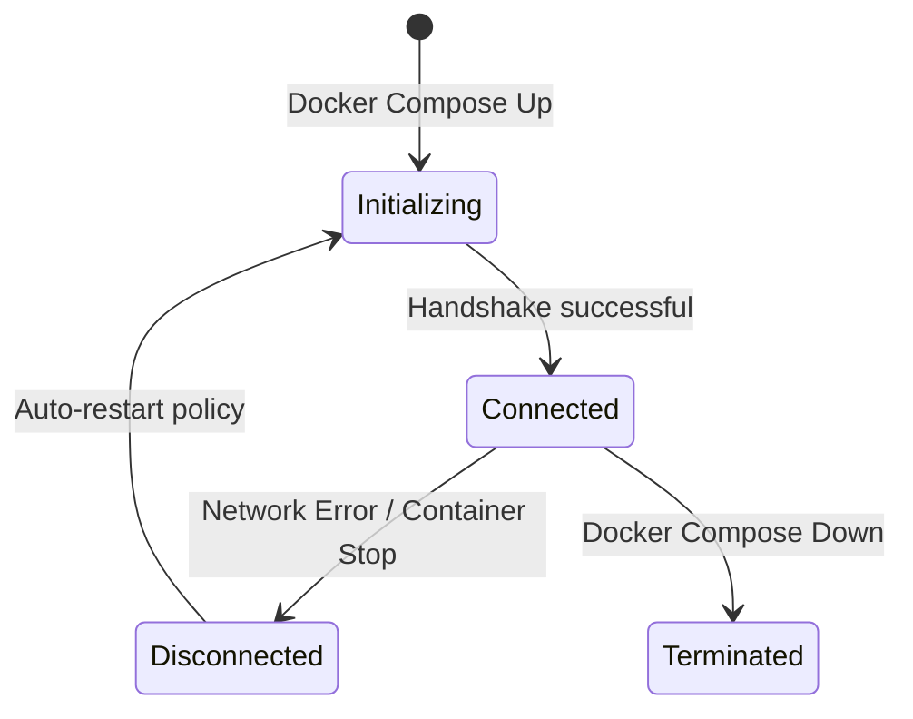

Traceability: Maps to NFR-2 (Containerized with Docker).

Object 6: CSV Export Job
The temporary process of data extraction.

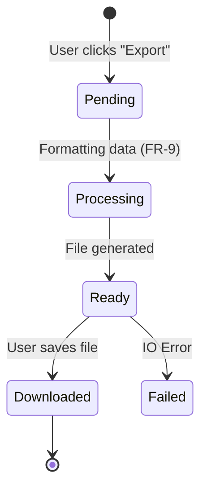

Traceability: Maps to FR-9 (Export to CSV).

Object 7: Category List
Manages the user's custom classification system.

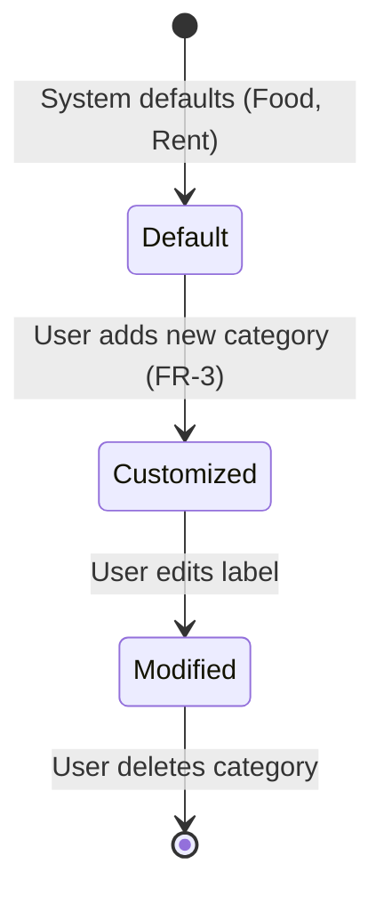

Traceability: Maps to FR-3 (Editable categories).

Object 8: Currency Context
Handles the global state of displayed values.

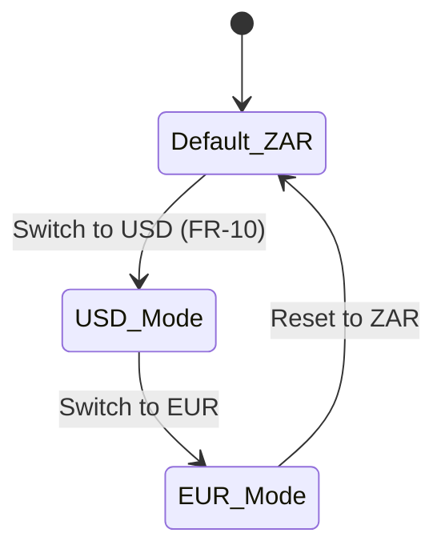
Traceability: Maps to FR-10 (Switch between currencies).    

## 2. Activity Workflow Modeling with Activity Diagrams

1. User Registration & Secure Setup
Maps to FR-1 and NFR-5.

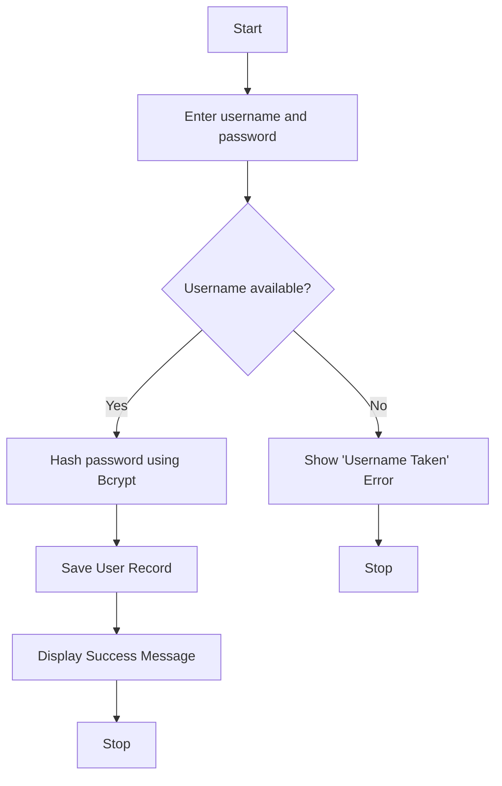

2. Logging a New Expense
Maps to FR-2, FR-3, and NFR-8 (Performance).

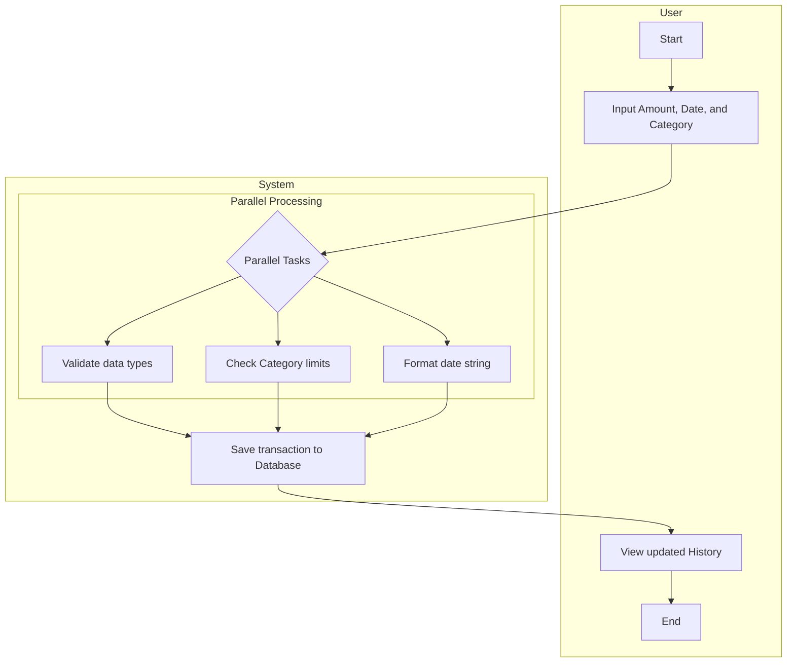

3. Setting and Monitoring a Budget
Maps to FR-5.

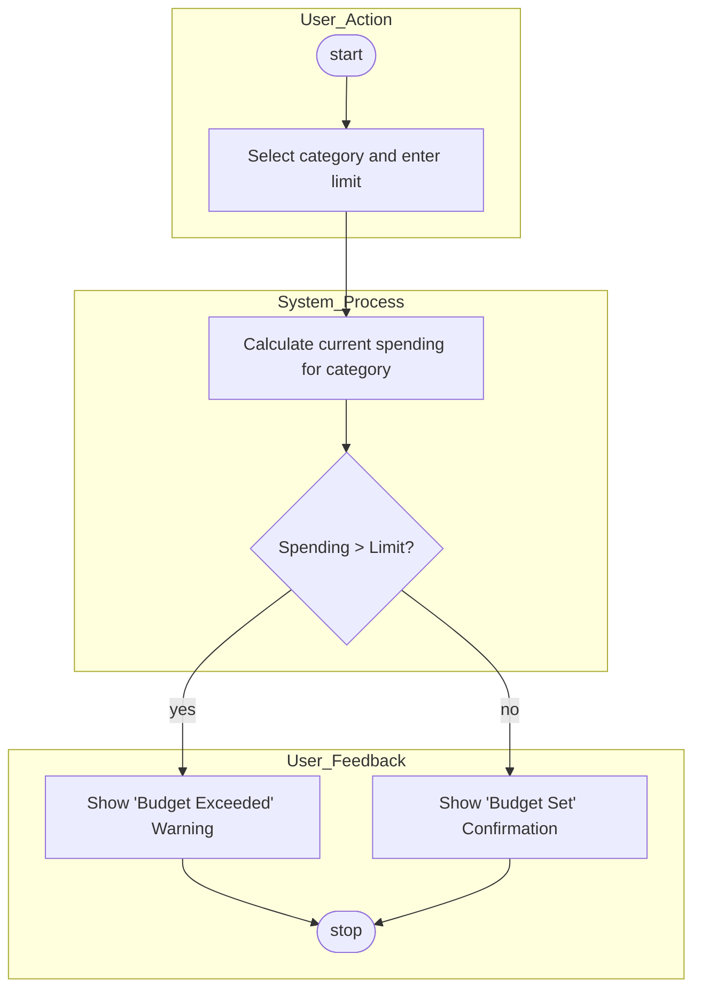

4. Visual Chart Refresh Workflow
Maps to FR-7 and NFR-7 (Performance).

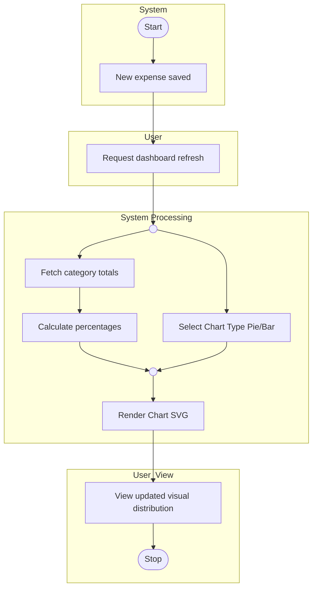

5. Exporting Data to CSV
Maps to FR-9.

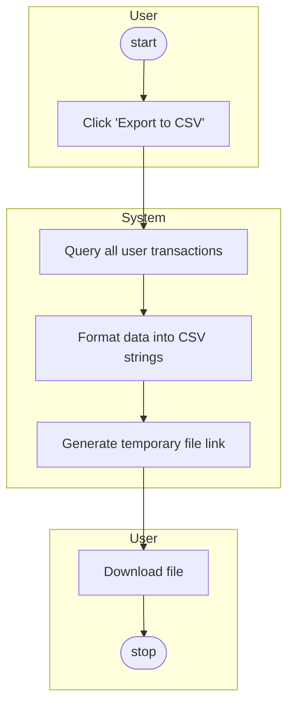

6. Automated Security Timeout
Maps to NFR-6.

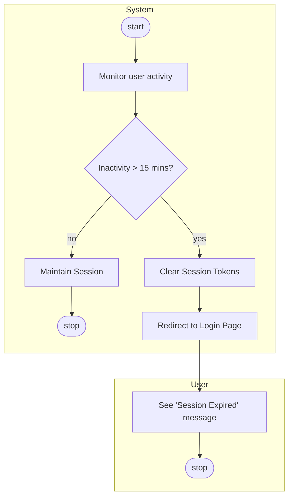

7. Editing an Existing Transaction
Maps to FR-8.

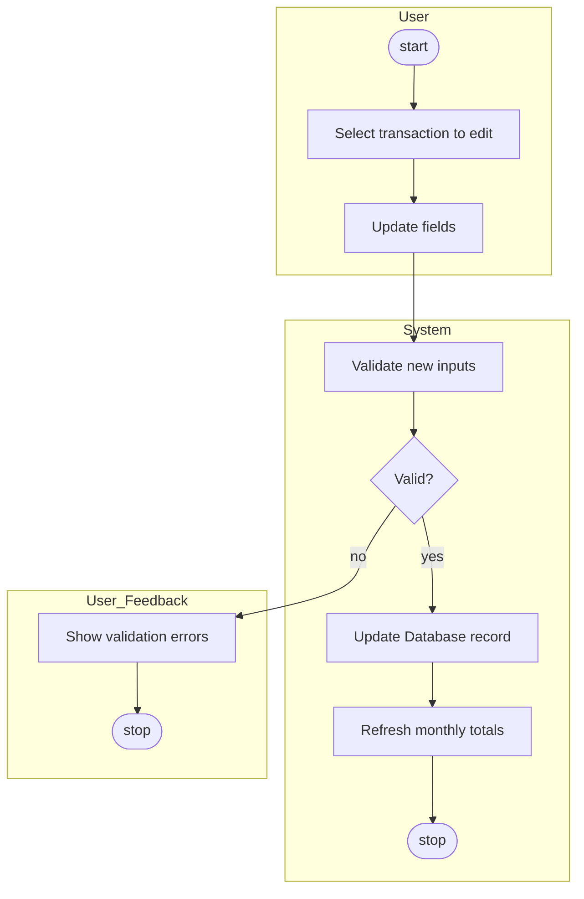

8. Currency Context Switching
Maps to FR-10.

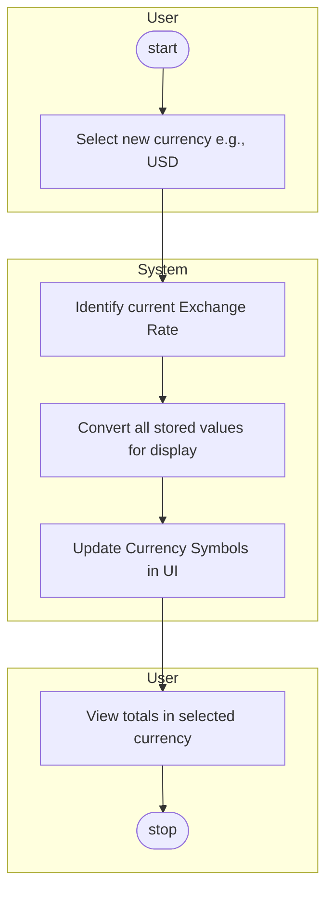

## 3. Integration with Prior Work:

| Diagram Name | Type | Requirement Link (Assignment 4) | User Story Link (Assignment 6) |
|--------| ---------| ------------| ------------| 
|Expense Lifecycle| State| FR-2, FR-8 | US-002 (Log Expense)|
|User Account Security| State| FR-1, NFR-5, NFR-6 |US-001 (Secure Account)|
|Budget Status| State| FR-5| US-004 (Monthly Budget)|
|Registration Workflow| Activity| FR-1, NFR-5| US-001 (Sign up)|
|Log Expense Workflow| Activity | FR-2, FR-3 |US-002, US-003 (Categorization)|
|Visual Chart Refresh|Activity|FR-7, NFR-7|US-006 (Spending Charts)|
|CSV Export Process| Activity| FR-9| US-007 (Data Export) |
|Docker Deployment| State|NFR-2|US-012 (Containerization)|

## Reflection:
Challenges in Choosing Granularity
The hardest part of this assignment was finding the right balance for granularity. 
When I started the Activity Diagrams, I wanted to map every single click, like "User clicks button" or "System highlights field." 
I quickly realized that this made the diagrams impossible to read and didn't actually explain how the system worked. 
I had to learn to "zoom out." I focused on high-level actions (e.g., "Validate Data") rather than tiny UI steps. This made the 
diagrams much cleaner and more useful for a developer to follow.

Aligning Diagrams with Agile User Stories
Aligning these formal UML diagrams with my Agile User Stories was another challenge. 
User stories are usually very simple and focused on the "why," while these diagrams are technical and focused on the "how."
For example, the user story for logging an expense sounds easy, but the Activity Diagram showed that the system actually 
performs several parallel tasks, like checking budget limits and formatting dates at the same time. 
This alignment helped me realize that some of my Effort Estimates from Assignment 6 were a bit low because 
I hadn't considered all these hidden technical steps.

Comparison: State Diagrams vs. Activity Diagrams
Through this process, I discovered that these two diagrams serve very different purposes:

State Diagrams (Object Behavior): These are about the "status" of a piece of data over its entire life.
For example, an Expense Entry isn't just a row in a table; it moves from a Draft to Saved, and potentially to Deleted. 
It’s about the "what."

Activity Diagrams (Process Flow): These are about the "logic" and the "timer." 
They show the step-by-step path a user takes to achieve a goal. It’s about the "how."

Conclusion
Using Mermaid in my GitHub README made these diagrams feel like a real part of the development process rather than just a school drawing. 
Even though I am the only stakeholder, seeing the User Account state diagram forced me to think about security states (like Locked or Timed Out) 
that I might have forgotten if I had only relied on my original list of requirements.

