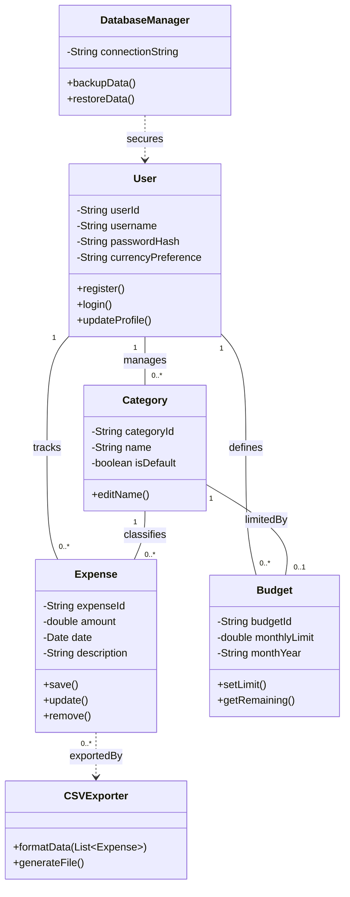

## Task 1: Domain Model
|Entity| Atrributes|Methods|Relationships|
|------|---------|----------|------------|
|User | userId, username, passwordHash, currencyPreference|register(), login(), logout()|1 to many with Expense, Budget, and Category|
|Expense|expenseId, amount, date, description|create(), edit(), delete()|Many to 1 with Category; Many to 1 with User|
|Category|categoryId, name, isDefault|addCategory(), editCategory()|1 to many with Expense; 1 to many with Budget|
|Budget|budgetId, monthlyLimit, monthYear|setLimit(), checkStatus()|Many to 1 with Category; Many to 1 with User|
|Chart|chartType, dataPoints|generateAggregation(), render()|Uses Expense data|
|Backup|backupId, timestamp, filePath|triggerBackup(), verify()|Associated with User data|

## Business Rules:

Security: User passwords must never be stored as plain text (must be passwordHash).

Validation: An Expense amount must always be a positive number (Value > 0).

Ownership: A User can only view, edit, or delete Expenses and Budgets linked to their specific userId.

Budgets: Only one Budget limit can exist per Category per month.

## Task 2: Class Diagram in Mermaid

## Key Design Decisions:
Composition vs. Association: I chose Association for User and Expenses. While expenses belong to a user, they are independent data records that can be exported or moved.

Utility Classes: I included CSVExporter and DatabaseManager as utility classes to handle FR-9 (Export) and NFR-2/UC-7 (Backups), separating logic from the core data entities (SOLID principles).

Multiplicity: A Category can have many Expenses, but an Expense can only belong to one Category to keep the math simple for the charts.

## Reflection:

The hardest part of designing this domain model was abstraction. 
As a developer, I kept trying to think about database tables instead of business objects. 
For example, I struggled with whether Category should be its own class or just a text field inside the Expense class. 
I eventually realized that since categories must be editable to meet the requirements, they needed to be a separate entity.

Defining relationships was also a tug-of-war. I felt resistance when deciding the relationship between Category and Budget. 
I originally thought a category could have many budgets, but that made the logic for the visual charts too complicated. 
I simplified it so that one category has one budget per month. This trade-off made the system easier to design while still meeting the user's needs.

This class diagram acts as the skeleton for everything in my previous assignments. 
The User class methods for login and registration map directly to my use cases. 
The Expense methods for saving and updating provide the triggers for the state cycles I modeled earlier. 
The attributes like amount and date are exactly what I defined in my functional requirements. 
Seeing it all in one diagram made me realize that my sprint plan was missing a database manager task, 
which I have now added to handle backups and security.

I made a major trade-off by choosing association over inheritance. 
I thought about having a general transaction parent class with expense as a child, 
but for a simple app, that felt like over-engineering. 
It would have made the code harder to maintain. Instead, I kept the classes flat and simple.

The biggest lesson I learned is that the structure of your data determines how easy or hard 
your workflows will be. If I had not separated the export logic from the expense data, the 
expense class would have become a god object that was too large and doing too many things. 
This taught me that good design isn't about how many classes you have, but about how clearly each class knows its own job.

