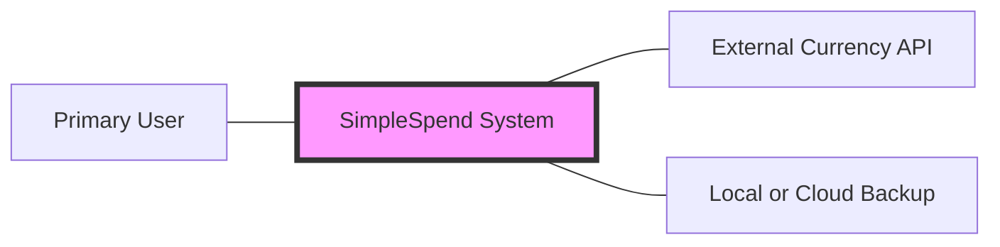
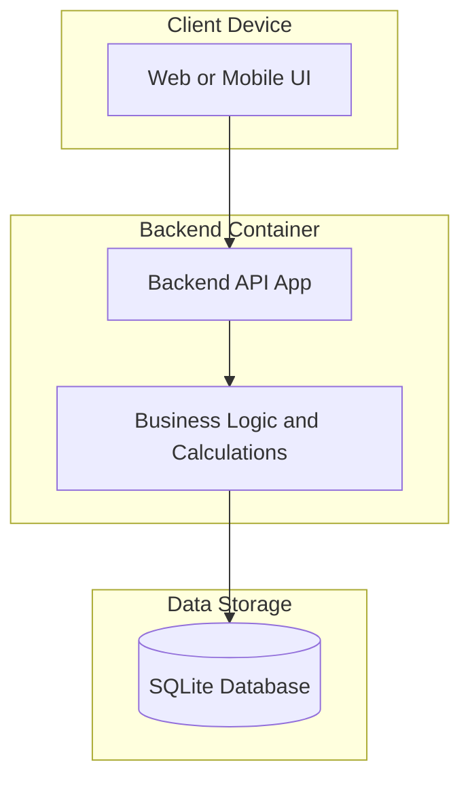

## C4 Architectural Diagrams

## Project Title: 
SimpleSpend: Personal Expense Tracker

## Domain: 
Personal Finance

## Problem Statement: 
To provide a secure and simple way for users to track spending 
without external bank integrations.

## Individual Scope: 
Feasibility is maintained by using a monolithic 
architecture with a single backend service and a local database.

## Level 1: System Context Diagram
How the SimpleSpend system interacts with the User and external things like the Currency API or Backup Storage:

## Level 2: Container Diagram
Shows the high-level technical building blocks. It explains that the system is split into a Frontend (UI), a Backend (API/Logic), and a Database (Storage):

