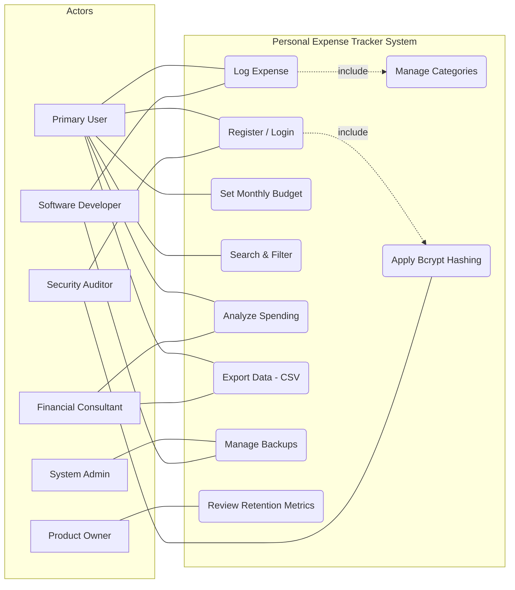

## 1. Use Case Diagram for Personal Expense Tracker

## Key Actors

The system involves six primary actors, each representing a critical stakeholder from your analysis:

1. Primary User: The central actor who initiates most functional tasks,
   such as logging expenses and viewing reports.
2. System Administrator: A technical actor responsible for maintaining
   the backend environment and ensuring data persistence.
3. Software Developer: An internal actor focused on the structural
   integrity and modularity of the codebase.
4. Security Auditor: A compliance-focused actor who ensures the
   system adheres to strict data protection and encryption standards.
5. Financial Consultant: An external consumer actor who utilizes the
   system's output (reports) for professional tax and financial planning.
6. Product Owner: A strategic actor who monitors the system's performance
   metrics to evaluate project feasibility and user growth.

## Relationships Between Actors and Use Cases:

The diagram utilizes standard UML relationships to define how 
these actors interact with the system's boundaries:

1. Associations (Solid Lines): These represent the direct participation of an actor in a use case.
   For example, the Primary User can initiate the Log Expense use case.
2. Inclusion (<<include>>): This indicates a mandatory dependency. The Log Expense use case includes
   the Categorize Expense use case, ensuring no transaction is saved without a valid category.
   Similarly, Register/Login includes Apply Bcrypt Hashing to ensure every account is secured by default.
3. Extension (<<extend>>): This represents optional functionality. The Search & Filter use case extends the
   general view of transactions, triggered only when a user needs to find a specific entry by keyword or date.
4. Generalization (Actors): While not explicitly drawn as a hierarchy, the Software Developer and System Administrator
   share a generalization relationship with "Technical Staff," as both interact with the Manage Backups functionality to ensure system reliability.

## Addressing Stakeholder Concerns:

The UML diagram serves as a direct blueprint to resolve the pain points identified in Assignment 4 Stakeholder Analysis:

 1. Primary User: The Log Expense use case is designed as a high-priority, low-click path to address the concern that manual entry "takes too long,"
    aiming for the success metric of logging an entry in < 10 seconds.
2. System Administrator: The Manage Backups use case directly addresses the fear of "loss of data if a local file is deleted," supporting the goal
   of a 100% backup success rate.
3. Security Auditor: By "including" Bcrypt Hashing in the authentication workflow, the diagram validates the auditor's concern regarding "plain-text storage"
   and ensures zero unencrypted data at rest.
4. Financial Consultant: The Export Data (CSV) use case addresses the pain point of "disorganized receipts" by providing a structured, 100% accurate data
   format for tax planning.
5. Product Owner: The Analyze Spending (Charts) and Review Retention Metrics use cases provide the visual engagement and data tracking necessary to achieve
   a 50% increase in daily active users.
7. Software Developer: By separating Manage Categories and Search & Filter into distinct modules, the diagram enforces the code maintainability and modularity
   required to prevent "spaghetti code" in the final application.

## 2. Use Case Specifications:

## 1. Use Case: Register / Login
Actor: Primary User / Security Auditor
Description: Allows a user to create a new account or access an existing one securely.
Precondition: User is on the Landing Page; system is connected to the database.
Postcondition: User is authenticated; a secure session token is generated.

Basic Flow:
1. User enters username and password.
2. System triggers Apply Bcrypt Hashing to the password.
3. System compares the hash against the database record.
4. System redirects the user to the Dashboard.
Alternative Flow: * Incorrect Credentials: System displays "Invalid Username/Password" and remains on the login page.

## 2. Use Case: Log Expense
Actor: Primary User / Software Developer
Description: The core function of recording a new financial transaction.
Precondition: User is logged in and on the "Add Expense" screen.
Postcondition: Expense record is saved in the database; Dashboard charts are marked for refresh.

Basic flow:
1. User enters amount, date, and description.
2. User selects a category (triggers Categorize Expense).
3. User clicks "Save."
4. System validates that the amount is a positive number.
5. System saves the transaction to the user's record.

Alternative Flow:Negative Amount: System displays an error: "Amount must be greater than zero."

## 3. Use Case: Set Monthly Budget

Actor: Primary User
Description: Allows users to define a spending limit for specific categories.
Precondition: At least one expense category exists.
Postcondition: A budget threshold is saved for the selected month/category.

Basic Flow:
1. User navigates to the "Budgets" tab.
2. User selects a category (e.g., "Food").
3. User enters a maximum spending limit.
4. System saves the limit and calculates current progress against it.

Alternative Flow:Budget Exceeded: System displays a visual warning (e.g., red progress bar) if current spending already exceeds the new limit.

## 4. Use Case: Search & Filter Expenses

Actor: Primary User
Description: Locating specific past transactions using keywords or dates.
Precondition: User is on the "Transactions History" page.
Postcondition: The list of displayed transactions is filtered according to user criteria.

Basic Flow:
1. User enters a keyword (e.g., "Woolworths") or a date range in the search bar.
2. System queries the database for matches within the user's ID.
3. System updates the table view to show only matching results.

Alternative Flow: No Results Found: System displays "No transactions match your search criteria."

## 5. Use Case: Analyze Spending (Charts)

Actor: Primary User / Product Owner
Description: Provides a visual distribution of expenses via pie or bar charts.
Precondition: At least one expense is logged for the current period.
Postcondition: Visual charts are rendered in under 1.5 seconds.

Basic Flow:
1. User views the Dashboard.
2. System aggregates spending totals by category.
3. System renders a pie chart showing percentage distribution.
4.System renders a bar chart comparing spending vs. budget.

Alternative Flow: No Data: System displays a placeholder image with the text: "Log your first expense to see your spending breakdown."

## 6. Use Case: Export Data (CSV)

Actor: Primary User / Financial Consultant
Description: Generates a downloadable file of all transaction data for external use.
Precondition: User has logged transactions.
Postcondition: A .csv file is generated and downloaded to the user's device.

Basic Flow
1. User clicks the "Export Data" button.
2. User selects "CSV" format.
3. System queries all transactions for that user.
4. System formats data into comma-separated values.
5. System triggers the browser download.

Alternative Flow: Empty Dataset: System disables the "Export" button if no transactions exist.

## 7. Use Case: Manage Backups

Actor: System Administrator
Description: Ensures data integrity by creating copies of the database.
Precondition: System is active; storage for backups is available.
Postcondition: A compressed backup file is created and verified.

Basic Flow
1. Admin (or automated script) triggers the "Backup" command.
2. System pauses write-access to the database momentarily.
3. System clones the current state of the database.
4. System saves the file to a secure, separate storage location.

Alternative Flow:Storage Full: System sends an alert to the Admin: "Backup failed: Insufficient storage."

## 8. Use Case: Enforce Session Timeout

Actor: Security System (Auditor)
Description: Automatically logs out users after a period of inactivity.
Precondition: A user session is currently active.
Postcondition: Session token is invalidated; user is redirected to the Login page.

Basic Flow:
1. System monitors the time since the last server request.
2. If the timer reaches 15 minutes without activity, the system triggers logout.
3. System clears all local session data.
4. System displays a message: "Session expired due to inactivity."

Alternative Flow:User Activity: If the user clicks or types before 15 minutes, the timer resets to zero.

## 3. Test Case Development 

| Test Case ID | Requirement ID | Description | Steps | Expected Result | Status |
|--------------|----------------|----------------|-------|-----------------|--------|
|TC-001| FR-01 | Account Creation Security| 1. Enter username/password. 2. Click "Create Account."| User is redirected to Dashboard; password is encrypted. | Pass | 
| TC-002 | FR-02 | Log Expense Entry | 1. Enter R250, "Groceries." 2. Click "Save." | Expense appears in the main transaction list.| Pass |
| TC-003 | FR-03 | Editable Categories | 1. Open Categories. 2. Rename "Food" to "Dining Out." | The dropdown list updates globally to "Dining Out." | Pass |
| TC-004 | FR-05 | Monthly Budget Warning | 1. Set Rent budget to R5000. 2. Log R6000 expense. | System displays a visual over-budget alert/indicator.| Pass |
| TC-005 | FR-06 | Search Filtering | 1. Type "ZARA" in the search bar. 2. View results. | Only transactions containing "ZARA" are displayed. | Pass |
| TC-006 | FR-07 | Immediate Chart Update | 1. Log a new high-value expense. 2. View the Pie Chart. | Chart segments adjust immediately without a page refresh. | Pass |
| TC-007 | FR-09 | CSV Export Accuracy | 1. Click "Export to CSV." 2. Open file in Excel. | All records, including date/category, are present/correct. | Pass|
| TC-008 | FR-10 | Currency Switching | 1. Select "USD" from currency menu. 2. View dashboard. | Totals are converted from ZAR to USD accurately. |  Pass |

## Non-Functional Test Scenarios

## These scenarios test the quality and security of the system:

## Performance Test: Speed & Scalability
Stakeholder Concern: Product Owner (User retention).

Requirement: Dashboard charts must load in < 1.5 seconds; API save time < 500ms.
Scenario: Populate a test account with 10,000 transaction records.
Steps: 1. Log in to the high-volume account.
       2. Use Chrome DevTools "Network" tab to time the API call for "Save Expense."

Success Metric: API responds in < 500ms, and the dashboard renders fully in < 1.5s.

## Security Test: Data Integrity & Session Safety
Stakeholder Concern: Security Auditor (Data Privacy).

Requirement: Bcrypt password hashing and 15-minute auto-logout.
Scenario: Verify encryption and session expiration.
Steps: 1. Check the database users table directly to verify no plain-text passwords exist.
       2. Leave the browser tab open and untouched for 15 minutes.

Success Metric: Database shows Bcrypt hashes; after 15 mins, the user is automatically redirected to the Login page with an "Expired" message.

## Reflection:
## Challenges in turning requirements into diagrams and tests
Translating a list of rules into a working plan for a Personal Expense Tracker was harder than it looked. There were three main challenges I faced during this project.

1. Turning Ideas into Actions
The first challenge was moving from "what" to "how." A requirement might say, "The user can categorize expenses." That sounds simple, but when I had to write the Use Case Specification, I realized it wasn't enough. I had to ask: What if the category the user wants isn't there? This forced me to add a new step for "Managing Categories." I learned that a requirement is just a wish, but a Use Case is a real-life play-by-play. If you don't think through every step, you miss important features.

2. Balancing Different Needs
The second challenge was keeping all the Stakeholders happy. In my analysis, the Primary User wanted everything to be fast (under 10 seconds). However, the Security Auditor wanted strict rules, like automatic logouts and complex password hashing.

When I drew the Use Case Diagram, I had to find a balance. Every security step I added made the app a little slower for the user. I had to use "Include" relationships to show that security isn't a choice, it’s part of every login. This taught me that designing a system is like a negotiation. You have to satisfy the Auditor’s need for safety without making the app too annoying for the User.

3. Making "Good" Measurable
The final challenge was the Non-Functional Requirements. Requirements like "the app must be fast" or "the code must be clean" are too vague. To write a Test Case, I had to use numbers. Instead of "fast," I had to say "under 1.5 seconds." Instead of "clean code," I had to specify "using SOLID principles."

Testing the Scalability requirement was the toughest part. It’s easy to test if a button works once, but it’s much harder to prove the system won't crash with 10,000 records. I had to think like a tester and define exactly what "failure" looks like.

Conclusion
Overall, I learned that a project is only as good as its details. By turning requirements into diagrams and tests, I found gaps in my original plan. This process turned a simple idea into a professional plan that actually solves the stakeholders' problems.
