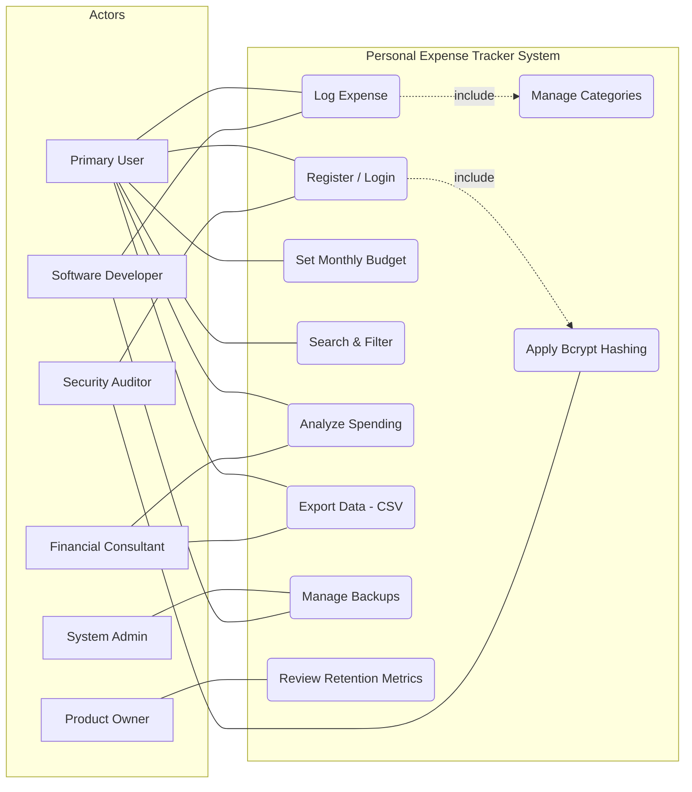

## Use Case Diagram for Personal Expense Tracker

## Key Actors

The system involves six primary actors, each representing a critical stakeholder from your analysis:

1. Primary User: The central actor who initiates most functional tasks,
   such as logging expenses and viewing reports.
2. System Administrator: A technical actor responsible for maintaining
   the backend environment and ensuring data persistence.
3. Software Developer: An internal actor focused on the structural
   integrity and modularity of the codebase.
4. Security Auditor: A compliance-focused actor who ensures the
   system adheres to strict data protection and encryption standards.
5. Financial Consultant: An external consumer actor who utilizes the
   system's output (reports) for professional tax and financial planning.
6. Product Owner: A strategic actor who monitors the system's performance
   metrics to evaluate project feasibility and user growth.

## Relationships Between Actors and Use Cases:

The diagram utilizes standard UML relationships to define how 
these actors interact with the system's boundaries:

1. Associations (Solid Lines): These represent the direct participation of an actor in a use case.
   For example, the Primary User can initiate the Log Expense use case.
2. Inclusion (<<include>>): This indicates a mandatory dependency. The Log Expense use case includes
   the Categorize Expense use case, ensuring no transaction is saved without a valid category.
   Similarly, Register/Login includes Apply Bcrypt Hashing to ensure every account is secured by default.
3. Extension (<<extend>>): This represents optional functionality. The Search & Filter use case extends the
   general view of transactions, triggered only when a user needs to find a specific entry by keyword or date.
4. Generalization (Actors): While not explicitly drawn as a hierarchy, the Software Developer and System Administrator
   share a generalization relationship with "Technical Staff," as both interact with the Manage Backups functionality to ensure system reliability.

## Addressing Stakeholder Concerns:

The UML diagram serves as a direct blueprint to resolve the pain points identified in Assignment 4 Stakeholder Analysis:

 1. Primary User: The Log Expense use case is designed as a high-priority, low-click path to address the concern that manual entry "takes too long,"
    aiming for the success metric of logging an entry in < 10 seconds.
2. System Administrator: The Manage Backups use case directly addresses the fear of "loss of data if a local file is deleted," supporting the goal
   of a 100% backup success rate.
3. Security Auditor: By "including" Bcrypt Hashing in the authentication workflow, the diagram validates the auditor's concern regarding "plain-text storage"
   and ensures zero unencrypted data at rest.
4. Financial Consultant: The Export Data (CSV) use case addresses the pain point of "disorganized receipts" by providing a structured, 100% accurate data
   format for tax planning.
5. Product Owner: The Analyze Spending (Charts) and Review Retention Metrics use cases provide the visual engagement and data tracking necessary to achieve
   a 50% increase in daily active users.
7. Software Developer: By separating Manage Categories and Search & Filter into distinct modules, the diagram enforces the code maintainability and modularity
   required to prevent "spaghetti code" in the final application.
